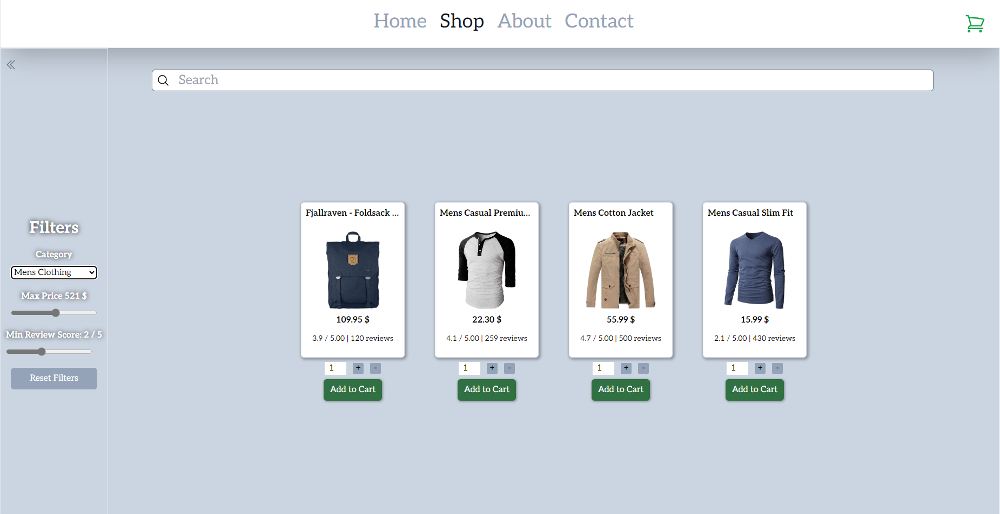

# React Shopping Cart Demo

A React shopping cart project made for the odin project. Implemented with the React Testng Library and the React Router API.

[Live Link](https://clinquant-longma-a64892.netlify.app/)



## DIY

If you would like to play around with the code yourself feel free to clone this repo, install all the node_modules with the

CMD:

```
    npm install
```

Command and then run

CMD:

```
    npm run dev
```

To start the vite server and test out the app.

## Folder Structure

```
    /.git
    /node_modules
    /public
    /src
        /assets         -> Favicon and Repo Image
        /components     -> Reuseable Components
        /pages          -> Page components
        /routes         -> React Router Implementation
        /styles
        /tests          -> Testing Code
        /utils          -> Utils
    main.jsx
    .eslint.cjs
    .gitignore
    index.html
    package-lock.json
    package.json
    postcss.config.js
    README.md
    tailwind.config.js
    vite.config.js
```

## Key Concepts

### React Components

React's powerful and reusable components are the building blocks of your demo shop page. These components allow you to create interactive UIs efficiently by encapsulating how the UI should behave and appear.

JS:

```
    import React from 'react';

    class Product extends React.Component {
        render() {
            return <h2>{this.props.name} - ${this.props.price}</h2>;
        }
    }

    export default Product;

```

In this snippet, we define a Product component, which takes name and price as props and renders a product's details. It's a class-based component, a common pattern for more complex features.

In a real-world scenario, such as in your demo shop, components like Product can be reused across different parts of the app, like product lists or feature items, ensuring UI consistency and code maintainability.

While this example uses a class-based component, React also offers functional components with Hooks, providing more ways to manage state and side effects in your components.

### React Router

React Router plays a crucial role in navigating between different views in your app. It keeps the UI in sync with the URL, making it feel like a traditional multi-page website but with the speed and fluidity of a single-page application (SPA).

JS:

```
    import React from 'react';
    import { BrowserRouter as Router, Route, Switch } from 'react-router-dom';
    import Home from './Home';
    import ProductPage from './ProductPage';

    function AppRouter() {
        return (
            <Router>
            <Switch>
                <Route exact path="/" component={Home} />
                <Route path="/product/:id" component={ProductPage} />
            </Switch>
            </Router>
        );
    }

    export default AppRouter;
```

This code sets up basic routing in your app. It uses BrowserRouter for HTML5 history API based navigation and Switch for rendering only the first route that matches the URL.

In your demo shop, React Router allows users to navigate between the home page and individual product pages without reloading the page, offering a seamless user experience.

React Router v6 brings in significant improvements with a focus on simplification and composability. It's worth considering for future projects or upgrades.

### React Testing

Testing in React ensures your application behaves as expected. It helps catch bugs early, improves code quality, and builds confidence in your codebase.

JS:

```
    import React from 'react';
    import { render, screen } from '@testing-library/react';
    import Product from './Product';

    test('renders Product component', () => {
        render(<Product name="Cool Sneakers" price="100" />);
        expect(screen.getByText(/Cool Sneakers - $100/i)).toBeInTheDocument();
    });
```

This test uses React Testing Library to render the Product component and asserts that it displays the correct content.

In your demo shop, testing components like Product ensures that changes in the code don't break existing functionality, making your app more reliable and easier to maintain.

Besides unit tests, consider integrating end-to-end tests with tools like Cypress for a more comprehensive testing strategy covering user flows.

## Todos

The unit tests still need to be implemented before this project can be considered finalized.
